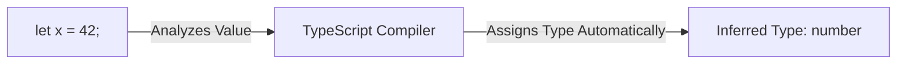

## TL;DR

**Type Inference** is TypeScript's ability to automatically deduce the type of a variable, return value, or array based on the value assigned to it. You don't need to explicitly write the type if the compiler can figure it out.

## Mental Model



## How It Works

TypeScript infers types in a few main scenarios:
1.  **Variable Initialization**: When you declare a variable and assign a value immediately.
2.  **Default Parameters**: When a function parameter has a default value.
3.  **Return Types**: By looking at the `return` statements inside a function.
4.  **Best Common Type**: When an array has mixed values, TS finds a type that encompasses all items.

## Example

```typescript
// 1. Variable Initialization (Inferred as 'string')
let message = "Hello World";
// message = 42; // Error: Type 'number' is not assignable to type 'string'

// 2. Best Common Type (Inferred as '(number | string)[]')
let mixedArray = [0, 1, "two"];

// 3. Return Type Inference (Inferred return type: number)
function multiply(a: number, b: number) {
    return a * b; // TS knows number * number = number
}
```

## Common Interview Questions

### Should you always rely on type inference?
No. While inference reduces boilerplate, you should **explicitly type** function return values and API responses. Explicit return types prevent accidental changes to a function's output from propagating bugs throughout the codebase, and they make the code easier to read for other developers.

### What is Contextual Typing?
Contextual typing works in the *reverse* direction. TypeScript infers the type of an expression based on the context it occurs in. For example, in `window.onmousedown = function(mouseEvent) { ... }`, TypeScript automatically knows `mouseEvent` is a `MouseEvent` because of the `onmousedown` context, without you needing to type it.
