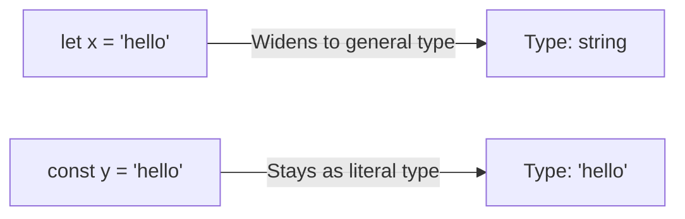

## TL;DR

**Type Widening** happens when TypeScript takes a very specific literal value (like `"hello"`) and "widens" its type to a more general category (like `string`) because the variable might change later. You can prevent this using `as const`.

## Mental Model



## How It Works

When you use `let`, TypeScript assumes you will reassign the variable later. So, if you assign `"pending"` to a `let` variable, it types it as `string`. 
When you use `const`, it knows the value can never change, so it assigns the exact **Literal Type** `"pending"`.

Object properties are always widened by default because objects are mutable, even if declared with `const`.

## Example

```typescript
// --- WIDENING ---
let status1 = "active"; // Type is widened to 'string'
status1 = "inactive";   // Allowed!

const status2 = "active"; // Type is exactly '"active"'
// status2 = "inactive";  // Error!

const config = {
    method: "GET" // Type is widened to 'string' because config.method can be reassigned
};

// --- PREVENTING WIDENING (as const) ---
const secureConfig = {
    method: "GET"
} as const; 

// Now 'method' is exactly '"GET"' and is marked readonly!
// secureConfig.method = "POST"; // ERROR: Cannot assign to 'method'
```

## Common Interview Questions

### What does `as const` do?
It applies **const assertions**. It tells the compiler to infer the narrowest, most specific literal types possible for an object or array, and marks all properties as `readonly`, deeply preventing any modifications or widening.

### Why does passing an object literal to a function sometimes cause a type error with strings?
If a function expects a specific union type like `"GET" | "POST"`, and you pass an object `{ method: "GET" }`, TypeScript widens the property to `string`. Since `string` is wider than `"GET" | "POST"`, it throws an error. You fix this by appending `as const` to the object.
