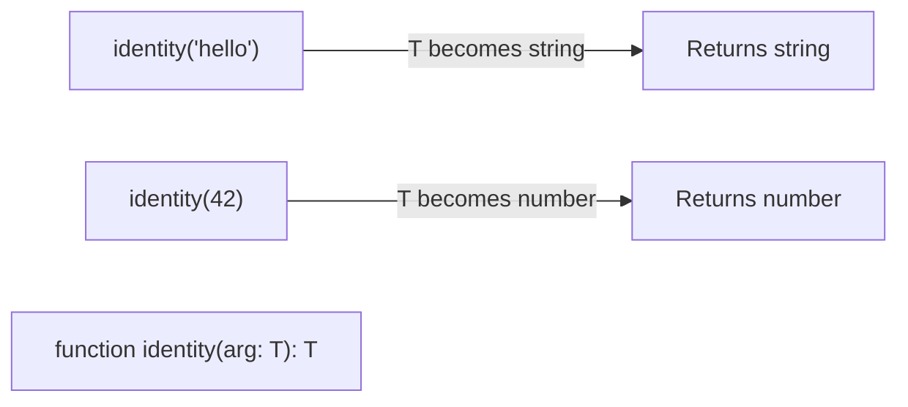

## TL;DR

Generics allow you to write reusable code that works with a variety of types rather than a single one, without sacrificing type safety (like `any` does). Think of Generics as **variables for types**.

## Mental Model



## Example

```typescript
// Without Generics: We lose type information (it returns any)
function wrapInArrayAny(arg: any): any[] {
    return [arg];
}

// With Generics: TypeScript tracks the specific type passed in
function wrapInArray<T>(arg: T): T[] {
    return [arg];
}

// Explicit usage
const stringArray = wrapInArray<string>("hello"); // Type is string[]

// Inferred usage (TypeScript guesses T based on the argument)
const numberArray = wrapInArray(42); // Type is number[]
```

## Generic Constraints (`extends`)

Sometimes you want a generic type, but you want to guarantee it has certain properties. You can constrain a generic using the `extends` keyword.

```typescript
interface HasLength {
    length: number;
}

// T must be a type that has a 'length' property
function logLength<T extends HasLength>(arg: T): void {
    console.log(arg.length);
}

logLength("hello");       // Allowed (string has .length)
logLength([1, 2, 3]);     // Allowed (array has .length)
// logLength(42);         // Error: number doesn't have .length
```

## Interview Questions

### How do you extract keys from a generic type?
Using the `keyof` operator. This is extremely useful for safely accessing object properties.
```typescript
function getProperty<T, K extends keyof T>(obj: T, key: K) {
    return obj[key];
}

const user = { name: "Alice", age: 30 };
getProperty(user, "name"); // Allowed
// getProperty(user, "email"); // Error: "email" is not a key of user
```

### Can you use Generics in Interfaces and Classes?
Yes. It's how `Array<T>` or `Promise<T>` work under the hood.
```typescript
interface ApiResponse<Data> {
    status: number;
    payload: Data;
}
```

## Common Gotchas

*   **Arrow Functions in JSX/TSX**: If you write an arrow function generic in a `.tsx` file like `const identity = <T>(arg: T) => arg;`, React/JSX gets confused thinking `<T>` is an HTML tag. 
    *   *Fix*: Add a comma to force it as a generic: `const identity = <T,>(arg: T) => arg;` or use `extends unknown`.

## Remember

> Generics let you capture the type the user provides, pass it through your function logic, and return it safely on the other side.
