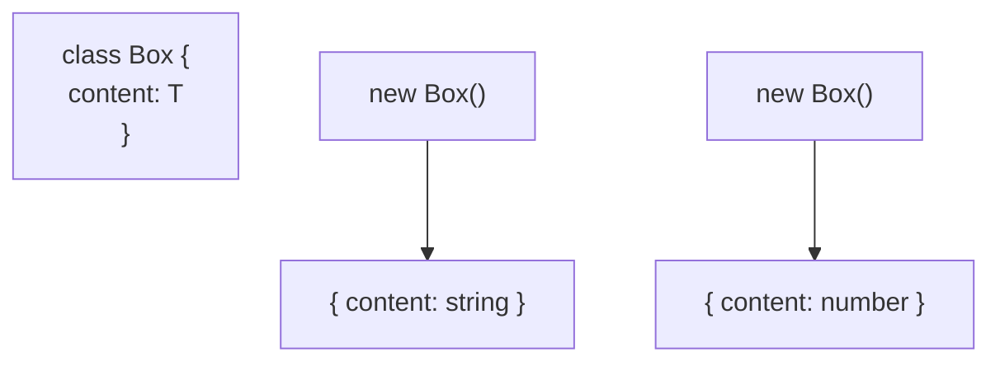

## TL;DR

**Generic Classes** allow you to create a class where the types of its properties and methods are defined at the moment you instantiate the class (`new ClassName<Type>()`). This is the standard way to build strongly-typed data structures like Stacks, Queues, or Caches.

## Mental Model



## How It Works

You place the generic type parameter `<T>` right after the class name. The entire class body then has access to `T`. 
You can use `T` as the type for instance properties, constructor arguments, or method return types.

## Example

```typescript
// A highly reusable, strongly-typed Queue data structure
class Queue<T> {
    private data: T[] = [];

    push(item: T): void {
        this.data.push(item);
    }

    pop(): T | undefined {
        return this.data.shift();
    }
}

// 1. A Queue specifically for numbers
const numberQueue = new Queue<number>();
numberQueue.push(10);
// numberQueue.push("hello"); // ERROR: Argument of type 'string' is not assignable to 'number'

// 2. A Queue specifically for objects
const taskQueue = new Queue<{ taskName: string }>();
taskQueue.push({ taskName: "Process Emails" });
```

## Common Interview Questions

### Can generic parameters be used on `static` members of a class?
**No.** Static members belong to the class itself, not the instance. Because the generic type `T` is determined when you create an *instance* (`new Queue<number>`), static properties cannot access `T` since they exist before the instance is created.

### How do Generics relate to React components?
In React (with TypeScript), `React.FC<Props>` or `React.Component<Props, State>` are just Generic Interfaces and Classes! You are passing your specific `Props` interface into React's generic definition so that React knows exactly what props your component expects.
