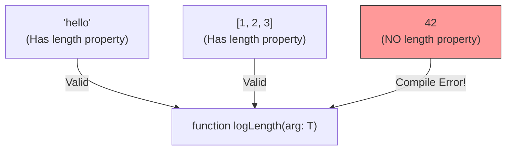

## TL;DR

By default, a generic parameter `<T>` can be absolutely anything (number, object, string). **Generic Constraints** (using the `extends` keyword) allow you to restrict `<T>` to only accept types that have a specific shape or specific properties.

## Mental Model



## How It Works

If you write a generic function that tries to access `arg.length`, TypeScript will throw an error because it doesn't know if `T` has a `.length` property. 

To fix this, you add a constraint: `<T extends { length: number }>`. Now, TypeScript will allow you to access `.length` inside the function, and it will throw an error if a developer tries to call the function with a number or boolean.

## Example

```typescript
// 1. Define the required shape
interface HasLength {
    length: number;
}

// 2. Constrain the Generic <T> to require that shape
function getLongest<T extends HasLength>(a: T, b: T): T {
    if (a.length >= b.length) {
        return a;
    }
    return b;
}

// Valid: Strings have a .length
getLongest("Alice", "Bob"); 

// Valid: Arrays have a .length
getLongest([1, 2], [1, 2, 3]); 

// ERROR: Argument of type 'number' is not assignable to parameter of type 'HasLength'.
// getLongest(10, 100); 
```

## Common Interview Questions

### Can you constrain a generic to be a specific primitive?
Yes. You can constrain generics to primitive unions: `<T extends string | number>`.

### What is the `keyof` constraint?
You can constrain a second generic type parameter to be a key of the first generic type parameter using `U extends keyof T`. This is heavily used when writing functions that access dynamic properties on objects (e.g., `function getProperty<T, K extends keyof T>(obj: T, key: K) { return obj[key]; }`).
