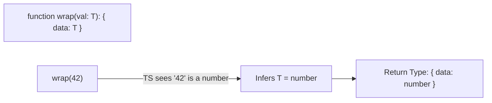

## TL;DR

When you call a Generic function, you usually don't need to explicitly pass the type inside angle brackets (`<string>`). TypeScript's **Generic Inference** looks at the arguments you pass in and automatically figures out what `T` should be.

## Mental Model



## How It Works

TypeScript is extremely smart at pattern matching. If your function signature is `function makeArray<T>(item: T): T[]`, and you call `makeArray("hello")`, TS looks at the first argument, sees a `string`, matches it against `item: T`, and instantly decides that `T = string`.

This keeps your code clean and removes visual clutter while maintaining 100% type safety.

## Example

```typescript
function merge<U, V>(obj1: U, obj2: V): U & V {
    return { ...obj1, ...obj2 };
}

// We DO NOT need to write: merge<{name: string}, {age: number}>(...)
// TS infers U and V automatically based on the two objects passed in.
const mergedObj = merge(
    { name: "Alice" }, 
    { age: 30 }
);

// mergedObj is perfectly typed as: { name: string } & { age: number }
console.log(mergedObj.name);
console.log(mergedObj.age);
```

## Common Interview Questions

### When does Generic Inference fail?
Inference fails (or infers `unknown` / `any`) when there are no arguments from which TypeScript can deduce the type. For example, if you have `function fetchApi<T>(): Promise<T>`, calling `fetchApi()` gives TS zero clues about what `T` is. In this case, you **must** explicitly provide the type: `fetchApi<User>()`.

### Can you provide a default type for a Generic?
Yes! Just like default function parameters, you can provide default generic parameters: `<T = string>`. If TS cannot infer the type, and you don't provide one, it will fall back to `string`.
