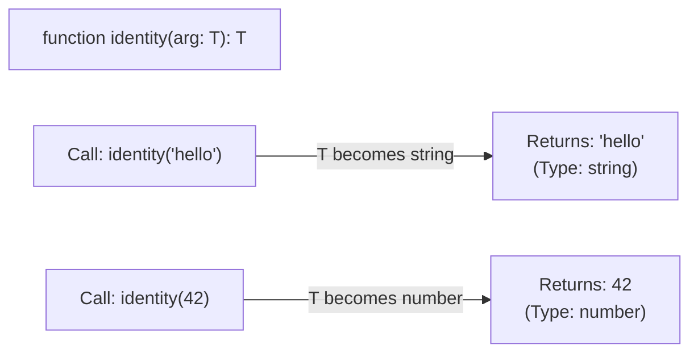

## TL;DR

**Generics** are like variables for types. They allow you to write a function, class, or interface that can work with any data type, without losing type safety. Instead of passing data into a function, you are passing a *Type* into the function.

## Mental Model



## How It Works

You define a generic type parameter (usually denoted by `<T>`) right before the function's arguments. You can then use `T` anywhere inside the function's signature or body. 

When you call the function, you provide the actual type, replacing `T` everywhere. If you don't provide it, TypeScript will usually infer it from the arguments.

## Example

```typescript
// The <T> declares a Type Parameter
function getFirstElement<T>(arr: T[]): T | undefined {
    return arr[0];
}

// 1. Explicitly passing the type
const num = getFirstElement<number>([1, 2, 3]); 
// 'num' is strictly typed as 'number'

// 2. Inference (TypeScript figures out T is 'string')
const str = getFirstElement(["a", "b", "c"]); 
// 'str' is strictly typed as 'string'

// --- GENERICS IN INTERFACES ---
interface ApiResponse<DataT> {
    status: number;
    data: DataT; // The inner data type is flexible!
}

const userRes: ApiResponse<{ name: string }> = {
    status: 200,
    data: { name: "Alice" }
};
```

## Common Interview Questions

### Why not just use `any` instead of Generics?
If you wrote `function getFirstElement(arr: any[]): any`, it would accept anything, but the return value would be `any`. You would lose all autocomplete and type safety for the rest of your program. Generics maintain the strict relationship between the input type and the output type.

### Can you have multiple generic parameters?
Yes. You can declare as many as you need: `function merge<T, U>(obj1: T, obj2: U): T & U { ... }`.
