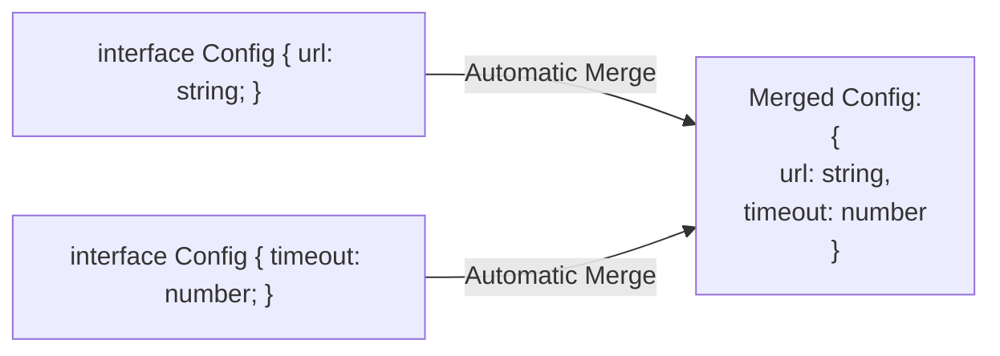

## TL;DR

**Declaration Merging** allows you to declare the same `interface` multiple times. TypeScript automatically merges all the properties from these multiple declarations into one single interface. This is widely used to extend third-party libraries (like extending the Express `Request` object to include a `user` property).

## Mental Model



## How It Works

This feature is exclusive to `interface` and `namespace` declarations. If you try this with `type` or `class`, TypeScript will throw a "Duplicate identifier" error.

It is heavily utilized in large Node.js and React codebases where different modules or middleware need to attach custom properties to global objects (like the `window` object in browsers, or `req` in Express).

## Example

```typescript
// 1. First declaration (perhaps inside a third-party library's types)
interface Document {
    title: string;
}

// 2. Second declaration (in your own codebase)
interface Document {
    customTrackerId: number;
}

// 3. Merged!
const doc: Document = {
    title: "My Page",
    customTrackerId: 12345 // TS knows this is perfectly valid!
};

// --- REAL WORLD EXPRESS.JS EXAMPLE ---
// When you use an auth middleware, you often attach a User to the Request.
declare global {
    namespace Express {
        interface Request {
            user?: { id: number; role: string };
        }
    }
}
// Now req.user is typed everywhere in your app!
```

## Common Interview Questions

### Can you merge conflicting property types?
No. If Interface A declares `id: string` and Interface B declares `id: number`, the compiler will throw an error. The properties must be unique, or if they share a name, they must have the exact same type.

### Can you merge function overloads?
Yes! If you declare the same function name inside two merged interfaces, they are combined as function overloads. This is how the DOM `document.createElement()` type is written—it's merged hundreds of times for every HTML element!
