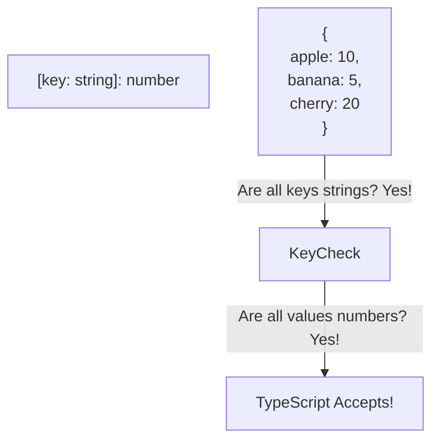

## TL;DR

An **Index Signature** is used when you don't know all the names of a type's properties, but you *do* know the shape of the values. It allows objects to act like dictionaries or hash maps.

## Mental Model



## How It Works

You define an index signature using square brackets.
The key type must be either `string`, `number`, `symbol`, or template literal strings.

*Warning:* Index signatures are very loose. If you access `myDictionary["nonExistentKey"]`, TypeScript will tell you it returns a `number`, even though it actually returns `undefined` at runtime. (Use the `noUncheckedIndexedAccess` compiler flag to fix this).

## Example

```typescript
// Define an interface with an Index Signature
interface SalaryMap {
    // There can be any string key, but the value MUST be a number
    [employeeName: string]: number;
}

const salaries: SalaryMap = {
    "Alice": 100000,
    "Bob": 85000,
    // "Charlie": "Intern" // ERROR: Type 'string' is not assignable to type 'number'
};

// You can mix specific properties with an index signature!
interface Configuration {
    id: string; // Specific property
    [key: string]: string; // Index signature for remaining properties
}

const config: Configuration = {
    id: "123",
    theme: "dark",
    language: "en"
};
```

## Common Interview Questions

### Can an interface have a specific property that conflicts with the index signature?
No. If the index signature says `[key: string]: number`, you cannot have a property `name: string`. *All* specific properties must match the return type of the index signature. If you need mixed types, the index signature must be a union: `[key: string]: number | string`.

### What is the difference between `Record<K, V>` and an Index Signature?
`Record<string, number>` is a built-in utility type that under the hood creates an index signature. They are functionally identical for simple use cases. However, `Record` is much easier to use when mapping over specific union types (e.g., `Record<"admin" | "user", boolean>`), which is impossible to do directly with a standard interface index signature.
