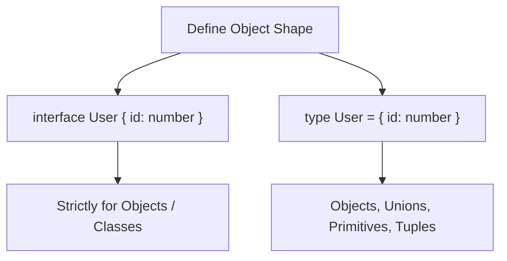

## TL;DR

In TypeScript, both `interface` and `type` (Type Aliases) can be used to describe the shape of an object. For most object-oriented use cases, they are nearly identical. 
However, **Types** are more versatile (they can represent unions and primitives), while **Interfaces** support "Declaration Merging" (they can be extended multiple times across different files).

## Mental Model



## How It Works

### Similarities
- Both can be `implemented` by a class (`class Admin implements User`).
- Both can be extended (Interfaces use `extends`, Types use `&` intersections).
- Both support optional properties (`?`) and `readonly`.

### Differences
- **Types** can be Unions (`type Status = "OK" | "ERROR"`). Interfaces cannot.
- **Types** can alias primitives (`type ID = string`). Interfaces cannot.
- **Interfaces** can be merged. If you declare `interface Window { title: string }` twice, TypeScript merges them into one interface. If you declare a `type` twice, it throws a duplicate identifier error.

## Example

```typescript
// --- INTERFACE (Object-oriented) ---
interface Animal {
    name: string;
}
interface Bear extends Animal {
    honey: boolean;
}

// --- TYPE ALIAS (Functional / Flexible) ---
type AnimalType = {
    name: string;
};
// Extension happens via Intersection (&)
type BearType = AnimalType & { 
    honey: boolean; 
};

// Types can do things Interfaces CANNOT do:
type ID = string | number; // Union Type
type Tuple = [number, string]; // Tuple Type
```

## Common Interview Questions

### Which one should I use?
The community consensus (and official TS handbook recommendation) is: **Use `interface` until you need a feature that `type` provides**. Interfaces yield slightly better error messages and compile slightly faster. Use `type` when you need Unions, Intersections, or mapped types.

### What is Declaration Merging?
If you are writing an NPM package and you export an `interface Config {}`, a user of your package can add their own fields to your config globally by simply declaring `interface Config { myCustomField: string }` in their own project. TypeScript magically merges them. This is impossible with `type`.
