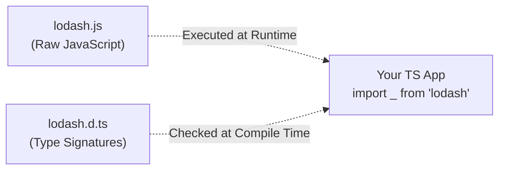

## TL;DR

A **Declaration File** (ending in `.d.ts`) contains *only* TypeScript types, interfaces, and function signatures. It contains zero executable JavaScript code. They are used to describe the shape of existing JavaScript libraries (like jQuery or Lodash) so TypeScript can provide autocomplete and type-checking for them.

## Mental Model



## How It Works

When you `import x from "module"`, TypeScript looks for type information. 
1. If the module is written in TS, it has types built-in.
2. If it is written in JS, TypeScript will look for a companion `.d.ts` file in the module's folder.
3. If it still can't find one, it looks in your `node_modules/@types` folder (the DefinitelyTyped repository).

If you are using a random untyped JS file in your project, you can write a custom `.d.ts` file to manually "declare" its types.

## Example

Imagine you have a legacy JavaScript file that calculates tax, and you want to use it safely in your new TS project.

```javascript
// legacy-math.js (No types here)
export function calculateTax(amount, rate) {
    return amount * rate;
}
```

You create a companion file with the exact same name, but with `.d.ts`.

```typescript
// legacy-math.d.ts (No logic here)
// The 'declare' keyword tells TS: "Trust me, this function exists at runtime."
export declare function calculateTax(amount: number, rate: number): number;
```

Now, when you import `calculateTax` in `app.ts`, TypeScript will enforce that `amount` and `rate` are numbers!

## Common Interview Questions

### What is the `DefinitelyTyped` repository?
It is a massive open-source GitHub repository where the community maintains high-quality `.d.ts` declaration files for thousands of popular NPM packages that were originally written in plain JavaScript (e.g., React, Express, Lodash). You install them via `npm install @types/express`.

### What happens if a library has no types and no `@types` package?
TypeScript will throw an error saying it cannot find a declaration file. You can bypass this by creating a global `declarations.d.ts` file in your project and adding `declare module "the-untyped-package";`. This silences the error and types the entire module as `any`.
