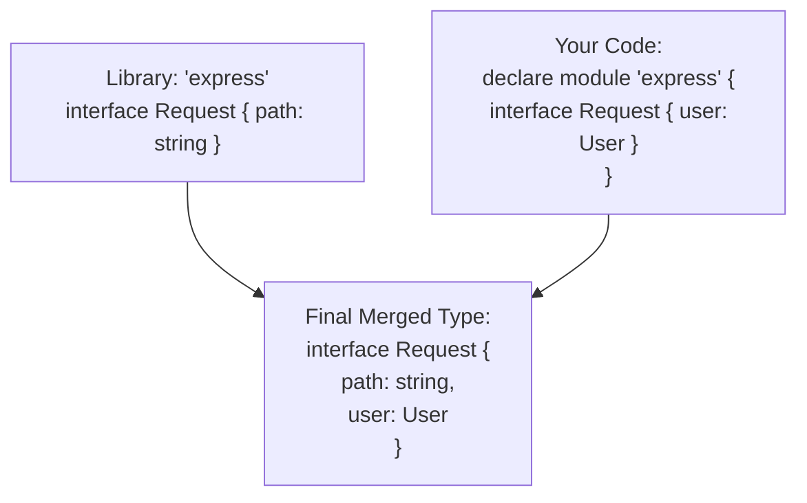

## TL;DR

**Module Augmentation** allows you to inject new properties or methods into types that belong to third-party NPM libraries. It combines the power of `declare module` with **Declaration Merging** to extend external interfaces safely.

## Mental Model



## How It Works

Often, you use a library (like Express or React) and you write a plugin or middleware that adds a new property to a core object. The actual JavaScript works fine, but TypeScript throws an error because the original library's `.d.ts` file doesn't know about your custom property.

By using `declare module "module-name"`, you can reopen the library's module and merge your new types directly into their existing interfaces.

## Example

Imagine we are using Express, and we write a middleware that adds a `user` object to the `req` (Request) object.

```typescript
import * as express from 'express';

// --- THE AUGMENTATION ---
// We tell TS we are modifying the 'express' module.
declare module 'express-serve-static-core' {
    // We reopen the existing Request interface.
    // (Because it's an interface, TS will merge this with the original one!)
    interface Request {
        user?: {
            id: number;
            role: string;
        };
    }
}

// --- USAGE ---
const app = express();

app.get('/dashboard', (req, res) => {
    // TS previously would error here: "Property 'user' does not exist on type 'Request'"
    // Now, thanks to augmentation, it knows exactly what req.user is!
    if (req.user?.role === 'admin') {
        res.send("Welcome Admin");
    }
});
```

## Common Interview Questions

### Can you augment a class or a type alias?
No. Module augmentation relies entirely on **Declaration Merging**, which only works for `interface` and `namespace` declarations. If a third-party library authored their core objects as `type` aliases instead of `interfaces`, you cannot augment them. (This is why library authors are strongly encouraged to export `interfaces`!).

### Where should I put my module augmentations?
You can put them in the same file where you implement the middleware, or for global augmentations, place them in a dedicated `types.d.ts` file at the root of your `src` folder (ensure it is included in your `tsconfig.json`).
