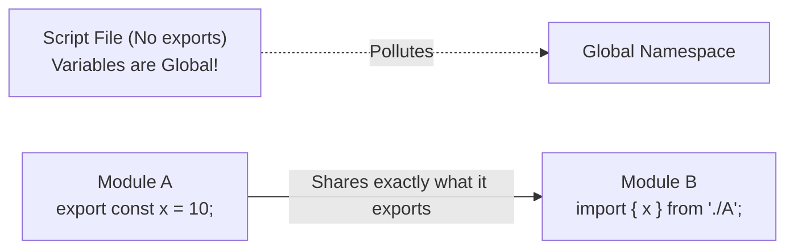

## TL;DR

In TypeScript, any file containing a top-level `import` or `export` is considered a **Module**. Variables, functions, classes, and types declared in a module are completely isolated to that file. To use them elsewhere, they must be explicitly exported and imported.

## Mental Model



## How It Works

TypeScript perfectly mirrors the ECMAScript Module (ESM) specification. 
If a file has *no* imports or exports, TypeScript treats it as a legacy "Script". In a script, any variable you declare becomes a global variable available across your entire project, which is highly dangerous and causes naming collisions.

*Always ensure your TypeScript files are Modules by adding at least one `export` statement.*

## Example

```typescript
// --- utils.ts (This is a Module) ---
export interface User {
    id: number;
    name: string;
}

export function formatName(user: User) {
    return user.name.toUpperCase();
}

// Internal variable, completely hidden from other files
const secretKey = "12345"; 


// --- app.ts (This is also a Module) ---
// We can import both runtime values (functions) and compile-time values (types)
import { User, formatName } from "./utils";

const u: User = { id: 1, name: "Alice" };
console.log(formatName(u));
```

## Common Interview Questions

### What happens if I want to write a file that has no exports, but I want TS to treat it as an isolated module?
You can force TypeScript to treat a file as a module by adding an empty export statement at the bottom of the file:
`export {};`
This instantly isolates the file's scope.

### Can you import CommonJS files (`require`) into an ESM TypeScript file?
Yes. If you are importing an older Node.js package that uses CommonJS, you can use the syntax `import * as _ from "lodash";` or enable the `esModuleInterop` flag in your `tsconfig.json` to allow standard default imports: `import _ from "lodash";`.
