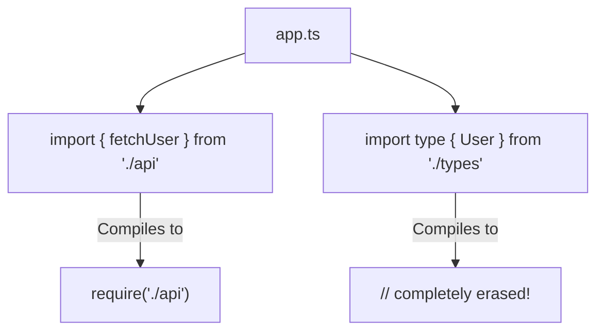

## TL;DR

**Type-Only Imports** (`import type`) guarantee that the imported module is completely erased during compilation. This prevents tools like Babel or esbuild from accidentally leaving empty `require()` or `import` statements in your compiled JavaScript, which can bloat bundle sizes or cause circular dependency crashes.

## Mental Model



## How It Works

Normally, TypeScript is smart enough to detect if you only used an imported symbol as a type (e.g., `let u: User`), and it will erase that import during compilation. 

However, modern toolchains often compile files *in isolation* (e.g., using `ts-loader` or `Vite`). These bundlers don't look at the entire project at once; they look at one file at a time. Therefore, they might not know if `User` is a type or a runtime value, so they leave the `import` in the compiled JS just to be safe. 

Adding the `type` keyword explicitly tells the bundler: *"This is definitely a type, erase it 100%."*

## Example

```typescript
// --- TYPESCRIPT FILE ---
import { fetchUser } from "./api";

// GOOD: Explicitly importing ONLY the type
import type { User, UserCredentials } from "./types";

// OR: Mixed inline types (TypeScript 4.5+)
import { login, type SessionConfig } from "./auth";

const myUser: User = fetchUser();

// --- COMPILED JAVASCRIPT OUTPUT ---
// Notice how './types' is completely gone!
const api = require("./api");
const auth = require("./auth");

const myUser = api.fetchUser();
```

## Common Interview Questions

### What happens if you try to use a type-only import as a value?
If you write `import type { UserClass } from './user'`, and then try to instantiate it with `new UserClass()`, TypeScript will throw an error: *"UserClass cannot be used as a value because it was imported using 'import type'"*.

### When should I use `import type`?
It is highly recommended to use it for all interface and type imports, especially in large codebases using Webpack, Vite, or Next.js. Many teams enforce this automatically using the ESLint rule `@typescript-eslint/consistent-type-imports`.
