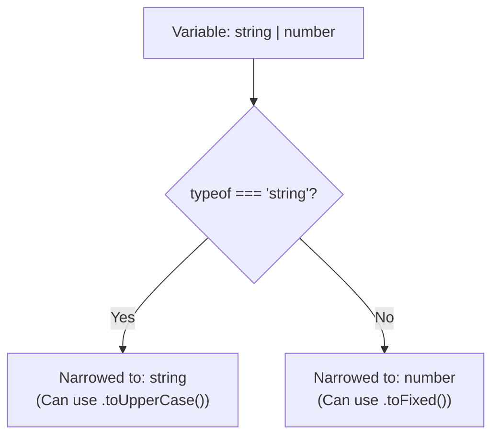

## TL;DR

Type Guards are TypeScript's way of analyzing runtime checks (like `typeof` or `instanceof`) to narrow down a variable's type within a specific block of code, allowing you to safely access type-specific properties.

## Mental Model



## Example: Built-in Type Guards

```typescript
function printId(id: number | string) {
    if (typeof id === "string") {
        // TypeScript KNOWS id is a string here
        console.log(id.toUpperCase());
    } else {
        // TypeScript KNOWS id is a number here
        console.log(id.toFixed(2));
    }
}
```

## Common Type Guards

1. **`typeof`**: Used for primitives (`string`, `number`, `boolean`, `symbol`).
2. **`instanceof`**: Used for classes and constructor functions (e.g., `if (error instanceof Error)`).
3. **`in` operator**: Used to check if an object has a specific property.
   ```typescript
   if ("bark" in animal) { /* animal is Dog */ }
   ```
4. **Equality (`===`)**: Used with literal types or discriminated unions.

## User-Defined Type Guards (Type Predicates)

Sometimes built-in checks aren't enough. You can write a function that returns a boolean, but tell TypeScript it's a type check using `arg is Type`.

```typescript
interface Cat { meow(): void; }
interface Dog { bark(): void; }

// The return type "pet is Cat" is the Type Predicate
function isCat(pet: Cat | Dog): pet is Cat {
    return (pet as Cat).meow !== undefined;
}

function handlePet(pet: Cat | Dog) {
    if (isCat(pet)) {
        pet.meow(); // Safely narrowed to Cat
    } else {
        pet.bark(); // Safely narrowed to Dog
    }
}
```

## Interview Questions

### What is a Discriminated Union?
A pattern where multiple interfaces share a common literal type property (a "discriminant"), making it extremely easy for TypeScript to narrow them down using a `switch` statement.
```typescript
interface Circle { kind: "circle"; radius: number; }
interface Square { kind: "square"; sideLength: number; }
type Shape = Circle | Square;

function getArea(shape: Shape) {
    switch (shape.kind) { // Discriminant
        case "circle": return Math.PI * shape.radius ** 2; // Narrowed to Circle
        case "square": return shape.sideLength ** 2;       // Narrowed to Square
    }
}
```

## Remember

> Type Guards bridge the gap between JavaScript's **runtime** logic and TypeScript's **compile-time** types.
