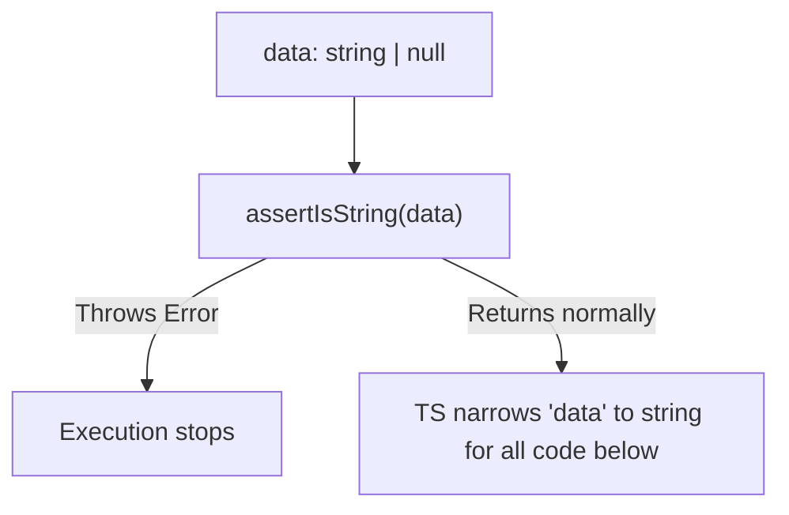

## TL;DR

An **Assertion Function** is similar to a custom type guard, but instead of returning `true`/`false` to be used in an `if` statement, it throws a runtime error if the condition isn't met. If the function *doesn't* throw, TypeScript narrows the type for the rest of the current scope.

## Mental Model



## How It Works

Node.js developers frequently use the built-in `assert` module to ensure values are correct before proceeding.
To make TypeScript understand this pattern, you use the `asserts parameterName is Type` signature. 
If the function completes execution without throwing, TypeScript applies that type narrowing to the variable for all subsequent lines of code in the block.

## Example

```typescript
// ASSERTION FUNCTION
function assertIsString(val: any): asserts val is string {
    if (typeof val !== "string") {
        throw new Error("Value is not a string!");
    }
}

function process(input: string | number) {
    // TS knows 'input' is string | number
    
    assertIsString(input);
    
    // If we reach this line, the function above didn't throw an error.
    // Therefore, TS permanently narrows 'input' to 'string' here!
    console.log(input.toUpperCase());
}
```

## Common Interview Questions

### When should you use Assertion Functions over Custom Type Guards?
Use **Custom Type Guards** (`is`) when you want to branch your logic gracefully (e.g., if it's a fish, do X, else do Y).
Use **Assertion Functions** (`asserts`) when you are enforcing a strict contract and the program *must* crash if the contract is violated (e.g., verifying that a highly critical configuration file was parsed perfectly on startup).

### Can you use `asserts` without a specific type?
Yes! You can use `asserts condition`. This is useful for generic assert functions.
```typescript
function assert(condition: any, msg?: string): asserts condition {
    if (!condition) throw new Error(msg);
}
// assert(user !== null); 
// TS now knows 'user' is not null.
```
