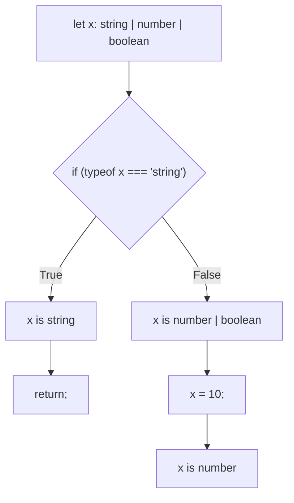

## TL;DR

**Control Flow Analysis** is the engine powering type narrowing. TypeScript statically analyzes how your code executes (following `if` statements, `returns`, `throws`, and `switch` cases) to constantly recalculate the type of a variable at every specific line of code.

## Mental Model



## How It Works

A variable's type is not static throughout a function; it evolves. 
If you have early returns, assignments, or throws, TypeScript updates the type information for the remainder of the block.

*   **Assignments**: Reassigning a variable narrows its type to the assigned value's type.
*   **Reachability**: If you `return` inside an `if (typeof x === 'string')`, TypeScript knows that for the rest of the function below the `if` block, `x` *cannot* be a string.

## Example

```typescript
function analyze(data: string | number | null) {
    // data is: string | number | null
    
    if (data === null) {
        return; // Early return!
    }

    // Because of the early return above, TS eliminates 'null'.
    // data is: string | number

    if (typeof data === "string") {
        // data is narrowed to: string
        console.log(data.length); 
    } else {
        // By process of elimination, data MUST be: number
        console.log(data.toFixed(2)); 
    }

    // Reassignment
    data = 42;
    // data is now strongly narrowed to: number (or specifically 42)
}
```

## Common Interview Questions

### Can Control Flow Analysis track mutations inside callbacks?
No, and this is a massive gotcha! TypeScript analyzes the *current* function's flow. If you narrow a variable, and then pass a callback to `setTimeout` or `array.map`, TypeScript forgets the narrowing inside the callback because it cannot guarantee when or if the callback executes, or if the variable was mutated in the meantime.
```typescript
let x: string | number = "hello";
if (typeof x === "string") {
    setTimeout(() => {
        // ERROR! TS forgets the narrowing here. 
        // It's back to string | number.
        // console.log(x.length); 
    }, 100);
}
```
