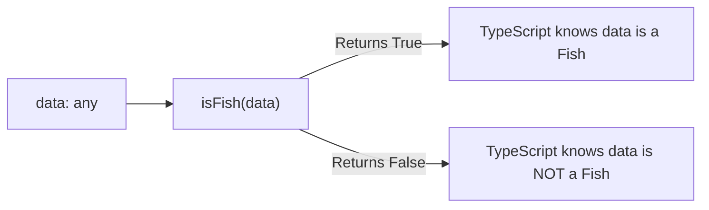

## TL;DR

When built-in type guards (`typeof`, `in`) aren't enough for complex objects, you can write a **Custom Type Guard**. This is a function that returns a boolean, but has a special return type signature: `parameterName is Type`.

## Mental Model



## How It Works

Sometimes you receive data from an API (e.g., as `unknown`) and need to verify it matches a specific Interface. A simple boolean function `function isFish(pet) { return pet.swim !== undefined; }` works at runtime, but it doesn't help the TypeScript compiler. 

To make the compiler understand, you change the return type from `boolean` to a **Type Predicate**: `pet is Fish`. 

## Example

```typescript
interface Fish { swim: () => void; }
interface Bird { fly: () => void; }

// CUSTOM TYPE GUARD
// Notice the return type: "pet is Fish"
function isFish(pet: Fish | Bird): pet is Fish {
    // We have to cast to Fish to check if the 'swim' property exists
    return (pet as Fish).swim !== undefined;
}

function move(pet: Fish | Bird) {
    if (isFish(pet)) {
        // Because isFish returned true, TS narrows 'pet' to Fish!
        pet.swim(); 
    } else {
        // Because it wasn't Fish, it must be Bird!
        pet.fly();
    }
}
```

## Common Interview Questions

### What is the danger of Custom Type Guards?
They are essentially Type Assertions (`as`). You are making a promise to the compiler. If your logic inside the custom type guard is flawed (e.g., it always returns `true` even if the object is wrong), TypeScript will blindly trust you, and your app will crash at runtime.

### Can custom type guards narrow `unknown` types?
Yes, this is their primary use case! When parsing JSON from an API, the result is `unknown`. You pass it through a robust custom type guard that checks every property at runtime, securely narrowing it to your domain model. (Though libraries like `Zod` do this automatically).
