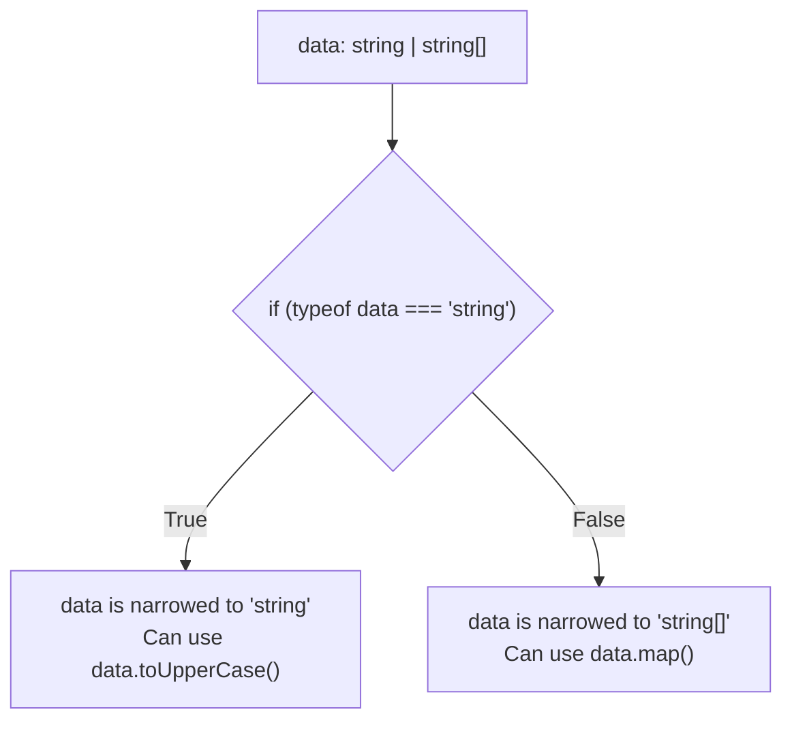

## TL;DR

**Type Guards** are standard JavaScript checks (like `typeof`, `instanceof`, or `in`) that TypeScript's compiler understands. When you use them inside an `if` statement, TypeScript automatically "narrows" a broad type (like a union or `unknown`) down to a specific type inside that block.

## Mental Model



## How It Works

TypeScript performs Control Flow Analysis. It reads your `if` and `else` branches just like the JavaScript engine does. 

Common built-in Type Guards:
- **`typeof`**: Checks primitives (`string`, `number`, `boolean`).
- **`instanceof`**: Checks if an object was created by a specific class.
- **`in`**: Checks if an object has a specific property key.
- **Truthiness**: Checks if a value is not null/undefined (`if (value)`).
- **Equality**: `if (value === "specific string")`.

## Example

```typescript
function processValue(val: string | Date | { title: string }) {
    
    // 1. typeof Type Guard
    if (typeof val === "string") {
        return val.toLowerCase(); // TS knows it's a string
    }

    // 2. instanceof Type Guard
    if (val instanceof Date) {
        return val.getTime(); // TS knows it's a Date
    }

    // 3. 'in' Type Guard
    if ("title" in val) {
        return val.title.toUpperCase(); // TS knows it's the object
    }
}
```

## Common Interview Questions

### Can you use `typeof` to check if a variable is an array?
No. In JavaScript, `typeof []` returns `"object"`. To check for an array, you must use `Array.isArray(val)`. Thankfully, TypeScript recognizes `Array.isArray()` as a valid type guard and will correctly narrow the type to an array.

### What happens to the type in the `else` block of a type guard?
TypeScript uses process of elimination. If `val` is `string | number`, and you do `if (typeof val === "string")`, inside the `else` block, TypeScript automatically knows `val` must be `number`.
