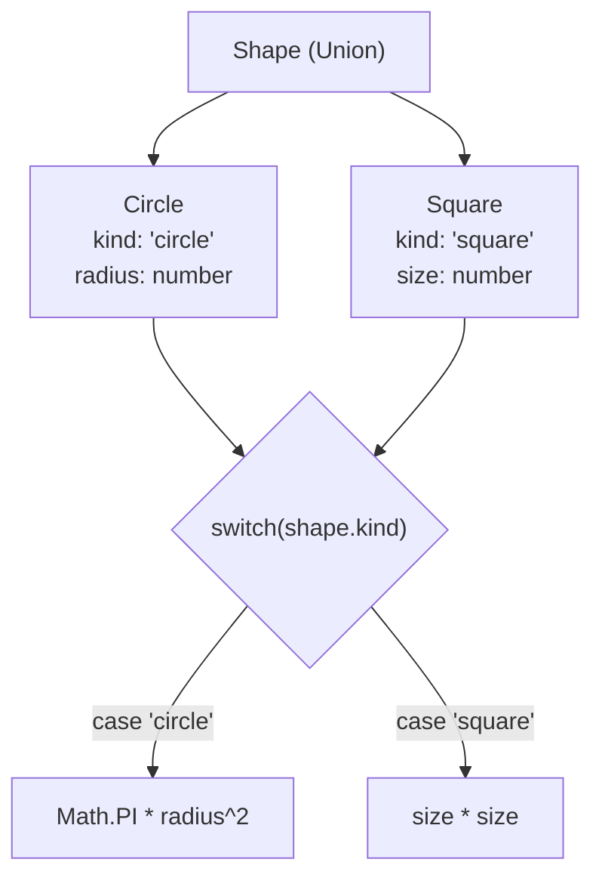

## TL;DR

A **Discriminated Union** (also called Tagged Union or Algebraic Data Type) is a pattern where every object in a union has a common, literal property (the "discriminator"). You use a `switch` or `if` statement on that property to let TypeScript narrow down the exact shape of the object.

## Mental Model



## How It Works

When dealing with complex API responses or Redux actions, a simple union type is hard to narrow safely. By adding a shared `type`, `kind`, or `status` property to all the objects, you give TypeScript an explicit tag to look at.

## Example

```typescript
// Define the specific shapes
interface LoadingState {
    state: "loading"; // The discriminator!
}
interface SuccessState {
    state: "success"; // The discriminator!
    data: string[];
}
interface ErrorState {
    state: "error";   // The discriminator!
    errorMessage: string;
}

// Combine them into a union
type AppState = LoadingState | SuccessState | ErrorState;

function renderUI(appState: AppState) {
    // Narrowing based on the discriminator property
    switch (appState.state) {
        case "loading":
            // TS knows 'appState' is LoadingState here
            return "Spinner...";
        case "success":
            // TS knows 'appState' is SuccessState here
            // It allows access to the 'data' property safely!
            return `Data: ${appState.data.join(', ')}`;
        case "error":
            return `Failed: ${appState.errorMessage}`;
    }
}
```

## Common Interview Questions

### Why not just use `if ('data' in appState)`?
Using the `in` operator works, but it becomes messy and error-prone as your unions grow larger and objects start sharing similar optional properties. Discriminated unions are explicit, scalable, and enable **Exhaustive Checking** (which is impossible with the `in` operator).

### What makes a good discriminator property?
It must be a literal type (like a specific string `"success"`, a specific number `1`, or a boolean `true`/`false`). It cannot be a general type like `string`.
