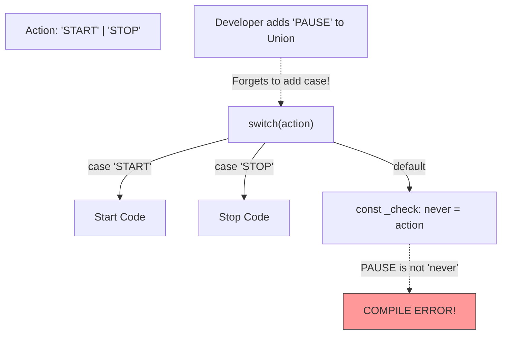

## TL;DR

**Exhaustive Checking** is a technique used with `switch` statements and discriminated unions. By assigning the default case to a variable of type `never`, you force the compiler to throw an error if you ever add a new type to the union but forget to handle it in your `switch` block.

## Mental Model



## How It Works

Because the `never` type can only be assigned to `never`, if your `switch` statement handles every possible case of a union, TypeScript determines that the `default` block is unreachable. Thus, the variable reaching the `default` block has the type `never`.

If you add a new string to the union, the `switch` is no longer exhaustive. The unhandled string falls through to the `default` block. Since a `string` cannot be assigned to `never`, TypeScript throws a compile error, saving you from a production bug!

## Example

```typescript
type Direction = "North" | "South" | "East" | "West";

function getHeading(dir: Direction) {
    switch (dir) {
        case "North": return 0;
        case "South": return 180;
        case "East": return 90;
        case "West": return 270;
        default:
            // EXHAUSTIVE CHECK
            // If someone adds "NorthWest" to the Direction type above
            // and forgets to add a case for it, 'dir' will be of type "NorthWest" here.
            // TypeScript will error: Type '"NorthWest"' is not assignable to type 'never'.
            const _exhaustiveCheck: never = dir;
            return _exhaustiveCheck;
    }
}
```

## Common Interview Questions

### Can't you just throw a runtime Error in the default block?
You can and should! `throw new Error("Unhandled case: " + dir)` is great for runtime safety. But exhaustive checking with `never` moves that failure from *runtime* (when the user crashes the app) to *compile time* (when you are typing in your IDE), which is vastly superior.

### Does this work with `if/else` chains?
Yes. As long as the final `else` block attempts to assign the narrowed variable to a `never` type, it works exactly the same as the `default` block in a `switch`.
