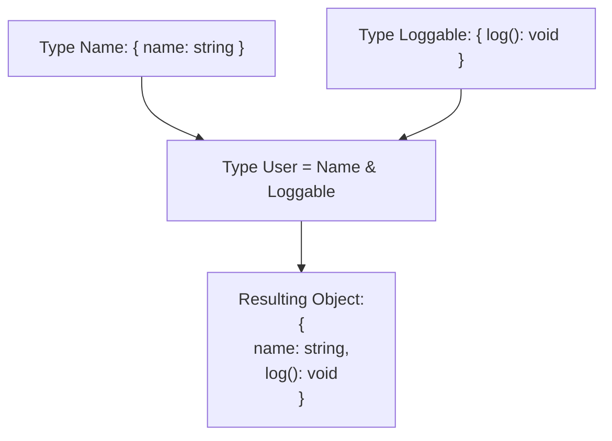

## TL;DR

An **Intersection Type** (using the `&` symbol) merges multiple types together. The resulting object must have **all** the properties of all the intersected types. It represents an **AND** relationship.

## Mental Model



## How It Works

Intersection types are mostly used to combine multiple interfaces or object shapes together. This is heavily used in React (combining default props with specific component props) or when applying mixins.

## Example

```typescript
type ErrorHandling = {
    success: boolean;
    error?: { message: string };
};

type UserData = {
    name: string;
    age: number;
};

// Intersecting the two types
type UserResponse = ErrorHandling & UserData;

// The object MUST contain properties from BOTH types
const response: UserResponse = {
    success: true,
    name: "Alice",
    age: 30
};
```

## Common Interview Questions

### What happens if you intersect conflicting primitive types?
If you intersect `string & number`, it is impossible for a value to be both at the same time. The resulting type will resolve to `never`.
```typescript
type Impossible = string & number; // Evaluates to 'never'
```

### What happens if you intersect two objects that share a property name but have different types for it?
If `TypeA` has `{ id: string }` and `TypeB` has `{ id: number }`, their intersection creates `{ id: never }`. Because the property `id` must satisfy both `string` and `number`, which is impossible.
