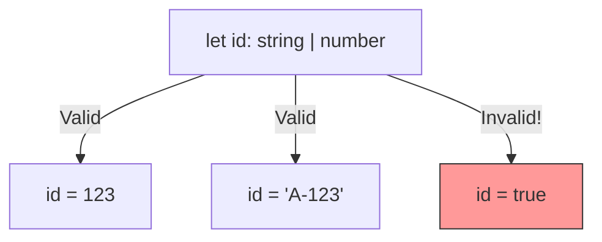

## TL;DR

A **Union Type** (using the `|` symbol) allows a value to be one of several distinct types. It represents an **OR** relationship. Before performing operations on a union type, you must "narrow" the type to be sure what you're working with.

## Mental Model



## How It Works

Union types are incredibly common for handling API responses (which might return an `User` object OR an `Error` object), configuration options, or handling CSS properties.

When a variable is a union type, TypeScript will only let you access properties or methods that are **common to all types** in the union. To access type-specific methods, you must use a type guard.

## Example

```typescript
function printId(id: number | string) {
    // ERROR: Property 'toUpperCase' does not exist on type 'number'
    // console.log(id.toUpperCase()); 

    // You must narrow the union first!
    if (typeof id === "string") {
        // Here, TS knows 'id' is definitely a string
        console.log(id.toUpperCase());
    } else {
        // Here, TS knows 'id' is definitely a number
        console.log(id.toFixed(2));
    }
}

printId(101);
printId("202");
```

## Common Interview Questions

### Can you create a union of literal values?
Yes! This is one of the most powerful features of TypeScript. You can restrict a variable to a specific set of exact strings or numbers.
`type Status = "pending" | "approved" | "rejected";`

### What happens if you try to access a property that only exists on one half of the union?
TypeScript will throw a compile error. You can only safely access the *intersection* of properties (properties that exist on *both* types). To access unique properties, you must use an `if` statement or the `in` operator to narrow the type.
