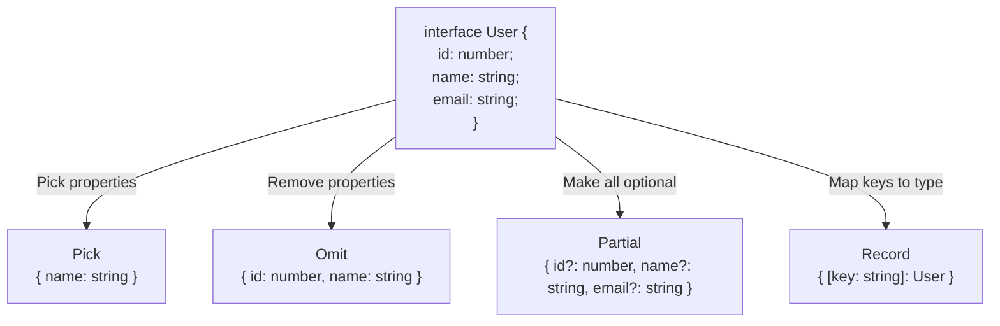

## TL;DR

Utility types are built-in global generics that allow you to transform existing types into new shapes without repeating code, keeping your codebase DRY.

## Mental Model



## Example

```typescript
interface Todo {
  id: number;
  title: string;
  description: string;
  completed: boolean;
}

// Partial: Great for update payloads
type UpdateTodoPayload = Partial<Todo>; 
// { id?: number, title?: string, description?: string, completed?: boolean }

// Pick: Great for selecting specific fields
type TodoPreview = Pick<Todo, "id" | "title">;
// { id: number, title: string }

// Omit: Great for removing sensitive data like passwords
type TodoWithoutId = Omit<Todo, "id">;
// { title: string, description: string, completed: boolean }

// Record: Great for dictionaries/maps
type TodoMap = Record<number, Todo>;
// { 1: Todo, 2: Todo, 3: Todo }
```

## Other Important Utilities

1. **`ReturnType<Type>`**: Extracts the return type of a function type.
   ```typescript
   function createServer() { return { port: 8080 }; }
   type Server = ReturnType<typeof createServer>; // { port: number }
   ```
2. **`Required<Type>`**: The opposite of Partial; makes all optional properties required.
3. **`Exclude<UnionType, ExcludedMembers>`**: Removes types from a union.
   ```typescript
   type Status = "Pending" | "Done" | "Failed";
   type ActiveStatus = Exclude<Status, "Done" | "Failed">; // "Pending"
   ```

## Interview Questions

### How is `Omit` implemented under the hood?
It uses a combination of `Pick` and `Exclude`.
```typescript
type MyOmit<T, K extends keyof any> = Pick<T, Exclude<keyof T, K>>;
```

### What is the difference between `any` and `Record<string, any>`?
`any` completely disables type checking for that variable. `Record<string, any>` explicitly states "This is an object where keys are strings and values can be anything", which still provides object-level constraints.

## Common Gotchas

*   **Using `Record<string, string>` instead of an Index Signature**: While similar, `Record` is cleaner for quick maps, but if you need to mix known properties with an index, you must use an interface index signature (`{ id: string, [key: string]: string }`).

## Remember

> Never repeat a type definition manually if a utility type can derive it for you.
