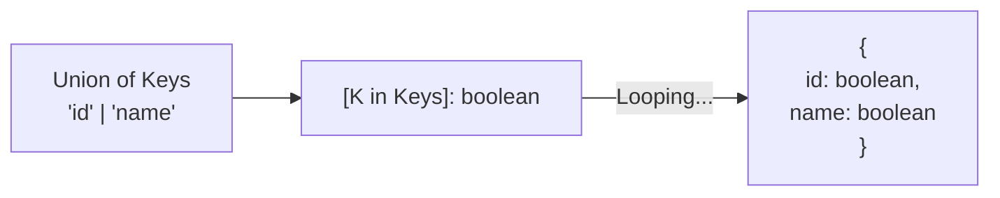

## TL;DR

A **Mapped Type** is a way to create a new type by iterating (looping) over the properties of an existing type. It acts like the `Array.prototype.map()` function, but for the Type System.

## Mental Model



## How It Works

The syntax relies on the `in` keyword inside square brackets: `[Key in UnionType]: ValueType`.

Mapped types allow you to:
1. Copy an existing type's keys exactly.
2. Add or remove modifiers like `readonly` or `?` using the `+` or `-` prefixes.
3. Change the type of the values.

*Note: Almost all built-in Utility Types (`Partial`, `Readonly`, `Pick`) are just mapped types under the hood!*

## Example

```typescript
// A base type
type FeatureFlags = {
    darkMode: () => void;
    betaTesting: () => void;
};

// --- MAPPED TYPE ---
// We want an object that has the EXACT same keys as FeatureFlags, 
// but all values must be booleans, and it must be readonly.

type BooleanFlags<T> = {
    readonly [Property in keyof T]: boolean;
};

// Usage:
type AppFlags = BooleanFlags<FeatureFlags>;
/*
AppFlags evaluates to:
{
    readonly darkMode: boolean;
    readonly betaTesting: boolean;
}
*/
```

## Common Interview Questions

### How do you remove the `readonly` modifier in a mapped type?
You use the minus (`-`) prefix in front of the modifier. 
```typescript
type Mutable<T> = {
    -readonly [P in keyof T]: T[P];
};
```
This loops over all keys of `T`, removes `readonly`, and assigns the original value type `T[P]`.

### Can you change the keys themselves during the mapping?
Yes, in TypeScript 4.1+, you can use **Key Remapping** with the `as` keyword. 
`[Property in keyof T as \`get${Capitalize<string & Property>}\`]: () => T[Property]` would turn an `{ id: number }` into `{ getId: () => number }`.
