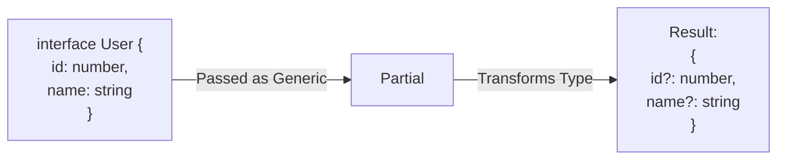

## TL;DR

TypeScript provides several built-in **Utility Types** globally. They are essentially helper functions that live in the type system. You pass an existing type into them, and they return a transformed version of that type (e.g., making all properties optional, or removing specific keys).

## Mental Model



## How It Works (The Core 5)

1.  **`Partial<T>`**: Takes type `T` and makes all its properties optional (`?`). Perfect for update/patch API endpoints.
2.  **`Required<T>`**: The opposite of Partial. Makes all properties mandatory (removes `?`).
3.  **`Readonly<T>`**: Makes all properties `readonly`. They cannot be reassigned after creation.
4.  **`Pick<T, Keys>`**: Creates a new type by picking *only* the specified keys from `T`.
5.  **`Omit<T, Keys>`**: Creates a new type by taking `T` and *removing* the specified keys.

## Example

```typescript
interface User {
    id: string;
    username: string;
    passwordHash: string;
    avatarUrl?: string; // Optional
}

// 1. Partial: Great for updating a user (you might only send the username)
function updateUser(id: string, updates: Partial<User>) { /* ... */ }
updateUser("123", { username: "Alice" }); // Valid!

// 2. Omit: Great for public API responses (never send the password out!)
type PublicUser = Omit<User, "passwordHash">;
const safeUser: PublicUser = {
    id: "123",
    username: "Alice",
    avatarUrl: "img.png" // Valid (and still optional)
};

// 3. Pick: Great for specific DB queries
type UserCredentials = Pick<User, "username" | "passwordHash">;
```

## Common Interview Questions

### What does `Record<K, T>` do?
It constructs an object type whose property keys are `K` and whose property values are `T`. It's a cleaner way to write an index signature, especially when mapping over a union of specific strings.
`type Roles = Record<"admin" | "guest", boolean>;` creates `{ admin: boolean; guest: boolean; }`.

### What is the difference between `Omit` and `Exclude`?
- **`Omit<T, Keys>`**: Operates on **Object Shapes**. It removes properties (Keys) from an interface/object type `T`.
- **`Exclude<UnionType, ExcludedMembers>`**: Operates on **Unions**. It removes specific types from a union (e.g., `Exclude<"a" | "b" | "c", "a">` results in `"b" | "c"`).
